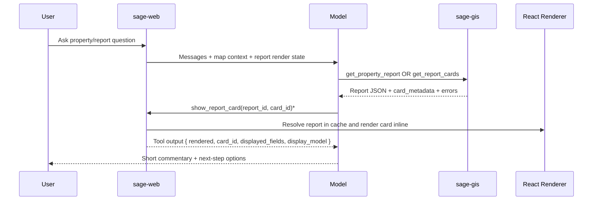

SAGE now uses a **card-first** report model:

- A **report** is a collection of cards (`report_id`, `report_type`, metadata).
- A **card** is the atomic render unit (`property.overview`, `property.districts`, etc.).

This page documents the technical contract across `sage-gis` and `sage-web`.

## Why this exists

The old pattern treated report parts as loosely-coupled "sections." That worked for a small property report, but it made card placement, interleaving, and follow-up reuse harder as the system grew.

The new contract standardizes:

1. Fetching full reports vs selected cards.
2. Rendering cards explicitly in message flow.
3. Teaching the model what is already visible in cards.

## Tool surface

| Tool | Service | Purpose |
|------|---------|---------|
| `get_property_report` | sage-gis | Fetch a full property report (all cards). |
| `get_report_cards` | sage-gis | Fetch selected cards (`cards: [...]`) for a report type. |
| `show_report_card` | sage-web local tool | Render a specific card inline using `report_id + card_id`. |

## Core contract

### Report response shape

```json
{
  "metadata": {
    "report_type": "property",
    "report_id": "report-1739999999999-abc123",
    "schema_version": "1.1.0"
  },
  "apn": "003-025-102",
  "address": "675 Texas Street, Fairfield, CA 94533",
  "generated_at": "2026-02-19T18:10:27.312Z",
  "overview": { "...": "card data" },
  "districts": { "...": "card data" },
  "card_metadata": {
    "overview": {
      "card_id": "property.overview",
      "card_key": "overview",
      "card_version": "1.0.0",
      "report_type": "property",
      "field_manifest": ["parcel.apn", "parcel.city", "assessment.total_value"],
      "display_model": ["APN", "City", "Assessment"]
    }
  },
  "errors": [
    {
      "card": "environment",
      "error_type": "CARD_ERROR",
      "message": "All environment queries failed"
    }
  ]
}
```

### Card metadata semantics

| Field | Meaning |
|-------|---------|
| `card_id` | Stable namespaced ID (`property.environment`). |
| `card_key` | Stable key in report payload (`environment`). |
| `card_version` | Version of card contract. |
| `field_manifest` | Dot-path list of fields shown in the rendered card. |
| `display_model` | User-facing labels currently present in UI. |

`field_manifest` and `display_model` are used by the model to avoid re-stating visible card data in prose.

## End-to-end flow



## Client-side rendering behavior

`sage-web` caches reports by `report_id` and resolves cards client-side:

1. Report data arrives from `get_property_report` or `get_report_cards`.
2. Report cached in memory (`report_id -> report payload`).
3. `show_report_card` resolves and renders a single card component.
4. Duplicate guard prevents rendering the same `report_id + card_id` twice in one assistant message.

## Dynamic model context

`sage-web` injects report-card state into system context on each turn:

- Active `report_id`, `report_type`, APN/address
- `available_card_ids`
- `rendered_card_ids`

This enables natural follow-ups like:

- "Tell me about the district here"
- "What hazards here?"
- "Show nearby"

without re-fetching unrelated data or re-stating card contents.

## Current property card IDs

- `property.overview`
- `property.hazards`
- `property.districts`
- `property.nearby`
- `property.environment`

## Extending to new report types

For future report families (`structures`, `zoning_extent`, `terrain`, etc.):

1. Add a new `report_type` implementation in `sage-gis`.
2. Return card payloads + `card_metadata` with stable `card_id`s.
3. Register renderer mapping in `sage-web`.
4. Update prompt/tool guidance for card-first routing.
5. Add tests for unknown card IDs and duplicate-render behavior.

## Related docs

- [sage-web](/services/sage-web)
- [sage-gis](/services/sage-gis)
- [MCP Protocol](/integration/mcp)
