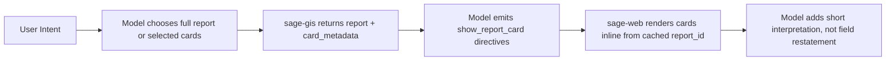

This is the design rationale behind SAGE's report/card system.

The short version:

- **Report** = data envelope and orchestration boundary.
- **Card** = UI/output boundary the user actually reads.
- The assistant should prefer cards when the question maps cleanly to card content.

## The problem we were solving

As report output grew, we saw three recurring issues:

1. The assistant repeated text that was already visible in cards.
2. Follow-up questions ("tell me about the district here") often triggered prose summaries instead of card reuse.
3. "Section" terminology blurred data fetch, rendering, and UX behavior.

With only a few cards, this was manageable. With dozens of future cards, it would not scale.

## Why "cards" became canonical

Users do not consume internal JSON keys; they consume visible cards in the message stream.

By making cards the canonical concept:

- Tool naming matches UI behavior (`get_report_cards`, `show_report_card`).
- The assistant can explicitly choose card placement and interleaving.
- Prompt guidance can target a concrete unit: "show this card first, then comment."

## Architectural shift

## Design choices that mattered

### 1) Explicit render directive

`show_report_card` separates **fetching data** from **placing UI**.  
That gives us deterministic ordering and clean interleaving with prose.

### 2) Metadata for model awareness

Each card advertises:

- `field_manifest`: what data is visible
- `display_model`: what labels the user sees

This is the bridge between backend schema and front-end visibility.

### 3) Turn-aware render state

`sage-web` sends active report/card context back to the model:

- available cards
- already rendered cards
- latest report identity

That makes follow-up routing reliable and reduces duplicate renders.

### 4) Full report + selective cards

Both modes are first-class:

- `get_property_report` for broad, one-shot report requests.
- `get_report_cards` for targeted follow-ups and interleaved workflows.

This keeps latency and token usage practical as card count grows.

## Tradeoffs

No architecture is free:

1. Prompt quality still matters. Smaller models can still over-summarize.
2. Card metadata must stay accurate or model behavior drifts.
3. Client-side render directives add state complexity in turn handling.

These are acceptable tradeoffs because they are explicit and testable.

## What this unlocks next

This model is intentionally report-type agnostic.

Near-term expansion can add report families like:

- `structures`
- `zoning_extent`
- `terrain`

without changing the orchestration pattern. New cards plug into the same fetch → render → comment loop.

## Practical guidance for prompt writers

When a question is a direct fit for card data:

1. Reuse the active report when possible.
2. Render the relevant card first.
3. Add concise interpretation (1-2 notable points), not a field dump.

That is the behavior users consistently perceive as "smart" and "non-repetitive."

## Closing thought

The key decision was not cosmetic renaming.  
It was choosing the **user-visible card** as the primary interaction unit and making every layer (tools, metadata, context, rendering) align to that unit.

That alignment is what makes the system scalable.
